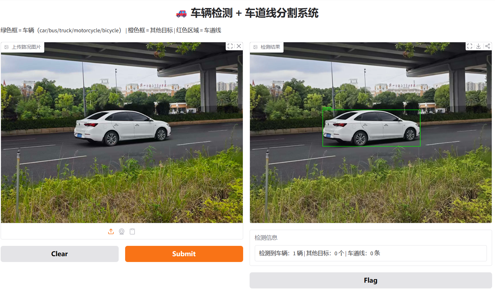
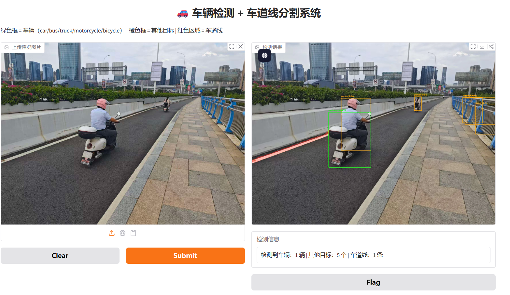
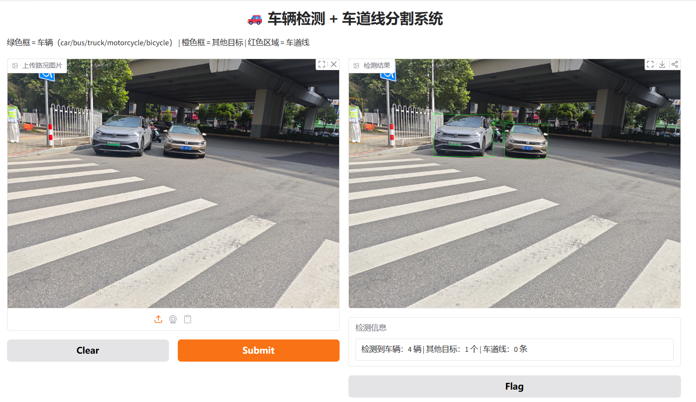

# 🚗 车辆检测 + 车道线分割系统

基于 **YOLOv8** 实现的道路场景感知系统，融合**车辆目标检测**与**车道线实例分割**，可用于自动驾驶感知入门、智能交通等场景。

## 在线演示

**[🔗 点击体验 Demo](https://a6cb3368e752bd896d.gradio.live)**

> 注意：Gradio 临时链接有效期约 1 周，失效后可重新运行代码生成。

## 项目展示

### 功能特点
- 车辆检测（支持 car / bus / truck / motorcycle / bicycle）
- 车道线实例分割（红色掩码可视化）
- 实时计数显示
- Gradio 在线交互界面

### 检测效果

**车辆检测示例**


**电动车 + 车道线**


**多车场景**


## 技术栈

- **检测模型**：YOLOv8（COCO 预训练）
- **分割模型**：YOLOv8n-seg（自定义车道线数据集训练）
- **Web 框架**：Gradio
- **其他**：OpenCV、Ultralytics

## 模型性能（车道线分割）

| 指标 | 数值 |
|------|------|
| Box mAP50 | 98.2% |
| Box mAP50-95 | 87.3% |
| Mask mAP50 | 93.5% |
| Mask mAP50-95 | 55.4% |

## 如何本地运行

```bash
pip install ultralytics gradio opencv-python
python app.py
```

## 项目结构

```bash
vehicle-lane-detection/
├── README.md
├── app.py                 # Gradio 演示代码
├── demo_car.png
├── demo_scooter.png
├── demo_crosswalk.png
└── weights/               # 模型文件（可选）
```

## 未来改进
- 使用自定义车辆数据集进一步提升检测精度
- 增加视频流实时检测与跟踪
- 部署到 Hugging Face Spaces 实现永久在线
- 尝试 TensorRT / ONNX 加速

## 作者：韩志强
## 项目定位：计算机视觉 / 自动驾驶感知入门项目

